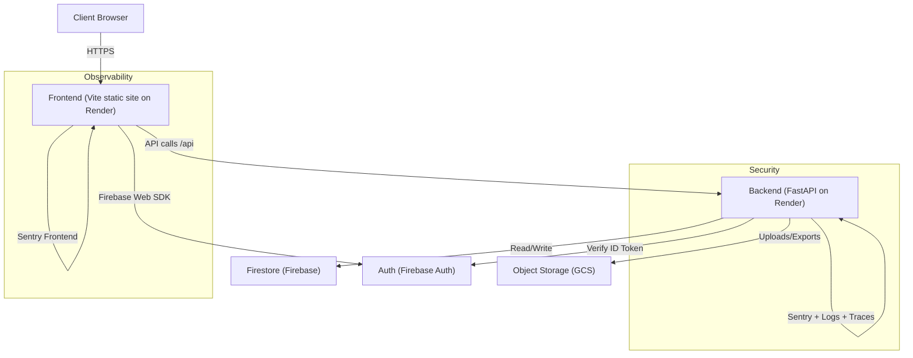

### Architecture Diagram

Source (Mermaid): `docs/arch/architecture.mmd`

Rendered:

```mermaid
graph TD
  A["Client Browser"]
  B["Frontend (Vite static site on Render)"]
  C["Backend (FastAPI on Render)"]
  D["Firestore (Firebase)"]
  E["Auth (Firebase Auth)"]
  F["Object Storage (GCS)"]

  A -->|"HTTPS"| B
  B -->|"API calls /api"| C
  B -->|"Firebase Web SDK"| E
  C -->|"Verify ID Token"| E
  C -->|"Read/Write"| D
  C -->|"Uploads/Exports"| F

  subgraph "Security"
    C -->|"CORS + Rate Limits + CSP"| C
  end

  subgraph "Observability"
    C -->|"Sentry + Logs + Traces"| C
    B -->|"Sentry Frontend"| B
  end
```

