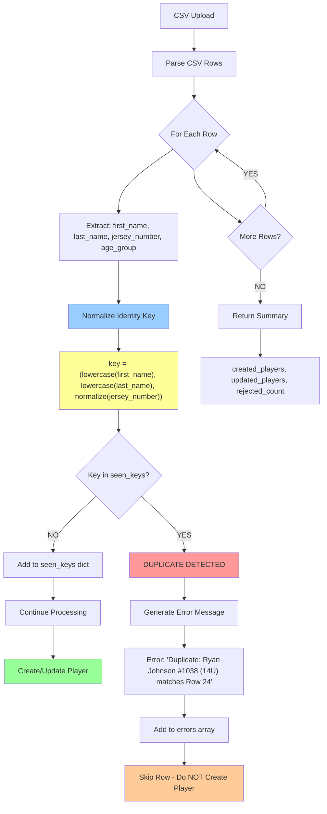
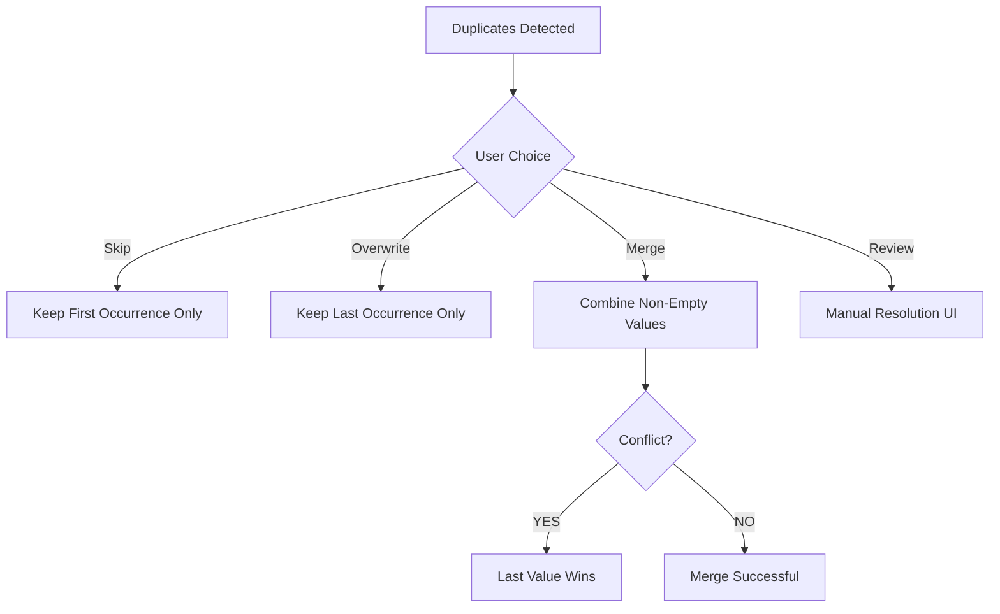

## Duplicate Detection Flow Diagram

### Key Points

**Identity Key Components:**
- ✅ `first_name` (lowercase, trimmed)
- ✅ `last_name` (lowercase, trimmed)
- ✅ `jersey_number` (normalized: "12.0" → 12)
- ❌ `age_group` (NOT included)

**Normalization Process:**
1. Names: Convert to lowercase, strip whitespace, remove invisible characters
2. Numbers: Convert `"12.0"` → `12` (integer), empty/null → `None`
3. Key Format: `(first_name, last_name, jersey_number)`

**Detection Logic:**
- First occurrence: Added to `seen_keys` dictionary with row number
- Subsequent occurrences: Rejected with detailed error message
- Error includes: First occurrence row number, all identity components, contextual tips

**Result Categories:**
- ✅ **Created Players:** New entries (first occurrence)
- ✅ **Updated Players:** Matched existing players
- ❌ **Rejected Rows:** Duplicates within file (second+ occurrences)

---

## Example Scenarios

### Scenario 1: Same Name + Number, Different Age Groups

```
Input CSV:
Row 1: Ryan, Johnson, 12U, 1038 → ✅ Created (first occurrence)
Row 2: Ryan, Johnson, 14U, 1038 → ❌ Rejected (matches Row 1)

Identity Keys:
Row 1: ('ryan', 'johnson', 1038)
Row 2: ('ryan', 'johnson', 1038) ← SAME KEY

Error: "Duplicate: Ryan Johnson #1038 (14U) matches Row 1. 
       Even though age groups differ (12U vs 14U), players with 
       the same name and number are considered duplicates."
```

---

### Scenario 2: Case Variations

```
Input CSV:
Row 1: john, smith, 12U, 42  → ✅ Created
Row 2: John, Smith, 12U, 42  → ❌ Rejected (matches Row 1)
Row 3: JOHN, SMITH, 12U, 42  → ❌ Rejected (matches Row 1)

Identity Keys (all identical after normalization):
Row 1: ('john', 'smith', 42)
Row 2: ('john', 'smith', 42)
Row 3: ('john', 'smith', 42)

Error: "Duplicate: John Smith #42 matches Row 1."
```

---

### Scenario 3: Number Format Variations

```
Input CSV:
Row 1: Mike, Davis, 14U, 12    → ✅ Created
Row 2: Mike, Davis, 14U, 12.0  → ❌ Rejected (matches Row 1)

Identity Keys (after normalization):
Row 1: ('mike', 'davis', 12)
Row 2: ('mike', 'davis', 12)  ← 12.0 normalized to 12

Error: "Duplicate: Mike Davis #12 matches Row 1."
```

---

### Scenario 4: Missing Jersey Numbers

```
Input CSV:
Row 1: Alex, Williams, 12U,   → ✅ Created
Row 2: Alex, Williams, 14U,   → ❌ Rejected (matches Row 1)

Identity Keys:
Row 1: ('alex', 'williams', None)
Row 2: ('alex', 'williams', None)

Error: "Duplicate: Alex Williams (no jersey number) matches Row 1.
       TIP: Assign unique jersey numbers to differentiate players 
       with the same name."
```

---

### Scenario 5: Different Jersey Numbers (NOT Duplicates)

```
Input CSV:
Row 1: Ryan, Johnson, 12U, 1038 → ✅ Created
Row 2: Ryan, Johnson, 12U, 2045 → ✅ Created (different number)

Identity Keys (DIFFERENT):
Row 1: ('ryan', 'johnson', 1038)
Row 2: ('ryan', 'johnson', 2045)

Result: Both rows successfully imported (different jersey numbers)
```

---

## Design Decisions

### Why Age Group Is Excluded from Identity

**Rationale:**
- Players can "play up" in higher age divisions
- Same player might compete in age-appropriate + advanced categories
- Jersey number is more reliable identifier within an event

**Trade-off:**
- ✅ Supports flexible roster management
- ❌ Users cannot import same name+number across age groups in single file

**Workaround:**
- Import each age group separately
- OR assign different jersey numbers to players in different divisions

---

### Why External ID Takes Priority (When Present)

```python
# Priority 1: External ID Match
if incoming_ext_id and incoming_ext_id in external_id_map:
    player_id = external_id_map[incoming_ext_id]['id']
else:
    # Priority 2: Name + Number Match
    player_id = generate_player_id(event_id, first_name, last_name, num)
```

**Rationale:**
- External systems (SportsEngine, TeamSnap) may have stable player IDs
- Name changes (marriage, spelling corrections) shouldn't create duplicates
- External ID provides stronger identity guarantee

**Consequence:**
- If CSV includes external_id column, that takes precedence for matching
- Within-file duplicate detection still uses name+number (simpler, more predictable)

---

## Future Enhancements (Phase 2)

### Potential Feature: Duplicate Merge Options



**Not Implemented Yet** – Waiting for user feedback on Phase 1 improvements

---

**Related Documents:**
- Technical Analysis: `docs/reports/CSV_DUPLICATE_DETECTION_UX_ANALYSIS.md`
- User Guide: `docs/guides/DUPLICATE_DETECTION_USER_GUIDE.md`
- Implementation Spec: `docs/reports/DUPLICATE_DETECTION_PHASE1_IMPLEMENTATION.md`

